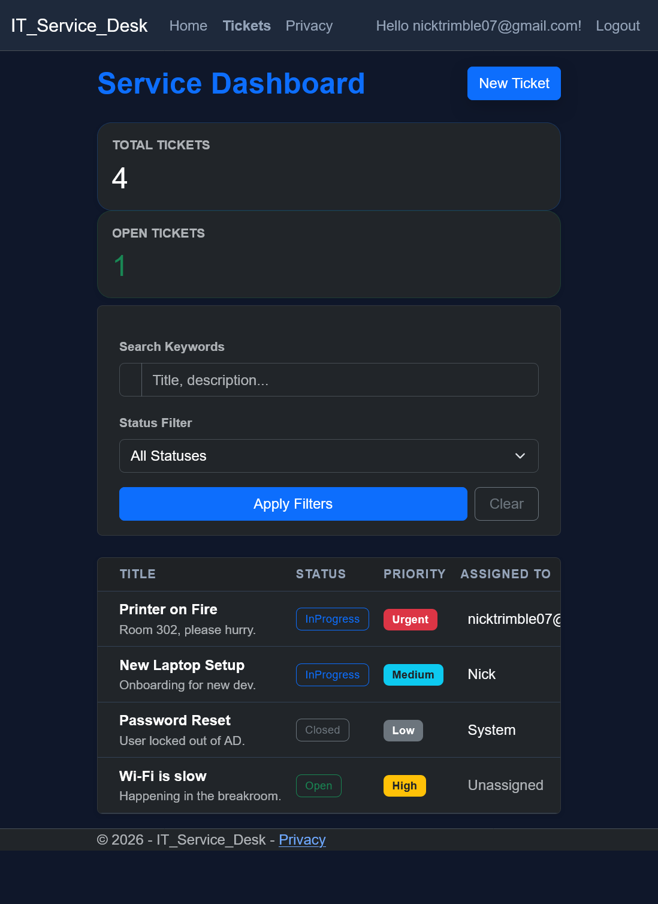

IT Service Desk

This is a ticketing system I built using .NET 10 and SQL Server. I wanted to move away from basic tutorials and build something that actually handles business logic, like user accounts and ticket status changes.
Core Features

    Security: I used ASP.NET Core Identity so users have to log in to see or edit tickets.

    Claim System: I wrote a backend method that lets a logged in tech click a button to claim a ticket. It automatically changes the status to In Progress and assigns it to their account.

    Search and Filter: I used LINQ to make the ticket list searchable by keywords or status.

    Custom UI: I modified the standard Bootstrap files to create a dark theme that looks like a modern tech platform.

Tech Used

    C# and .NET 10

    ASP.NET Core MVC

    Entity Framework Core

    SQL Server

    Bootstrap 5

How it works

The app uses the MVC pattern to keep the logic separated. The database is handled through migrations in EF Core. For the UI, I used Razor views and custom CSS to make sure the dashboard was easy to read and worked on different screen sizes.