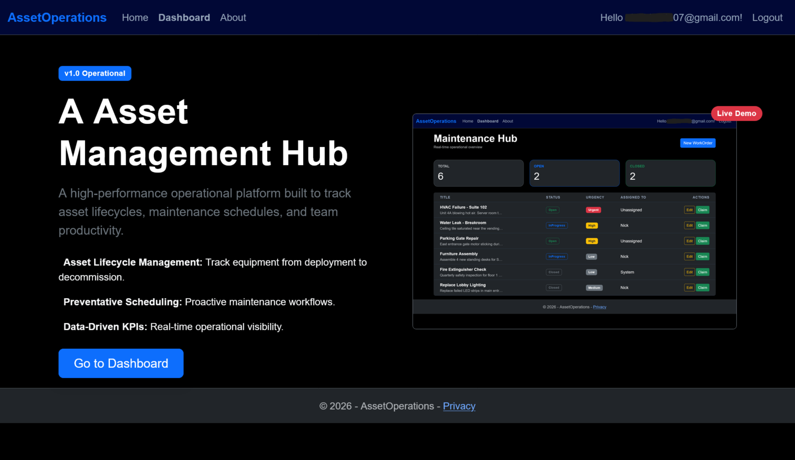

AssetOperations

I built AssetOperations because most basic ticketing systems are essentially "black holes" for data. You open a ticket, you close it, and the history of that asset is gone. I wanted a platform for facility management that actually keeps track of the lifecycle of an asset, so I built this to solve that.

The standout feature here is the audit trail. Instead of manually writing logging code into every single controller action—which is messy and easy to forget—I used a database interceptor in Entity Framework. Now, every time a WorkOrder is created or modified, the system automatically captures the change, the timestamp, and the context in an AuditLog table. It’s a "black box" recorder that runs in the background, so the data is always there when management needs it.

I also moved this project away from "prototype" status by switching from EnsureCreated (which wipes your database on every change) to proper EF Core Migrations. This means the schema is version-controlled and stable. I tied everything together using ASP.NET Core Identity for secure access, and I wrote a custom "Claim" method so technicians can take ownership of tasks with one click, which automatically updates the status and assignee.

For the interface, I wanted a clean, high-contrast look that’s easy on the eyes during a long shift. I modified the default Bootstrap theme into a dark, terminal-inspired style using CSS variables, which keeps the code maintainable and makes it look like a real-world ops tool.

The Tech Stack:

    .NET 10 / ASP.NET Core MVC

    Entity Framework Core (Code-First)

    SQL Server

    Bootstrap 5 (Custom CSS)

    ASP.NET Core Identity

